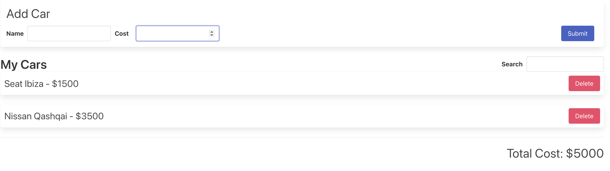

# React_Cars_Garage

Repository created following this [Udemy Course](https://www.udemy.com/course/react-redux/) to practice the following basic React concepts:

- Redux

## Application

Application aims to list some different cars that end end user has entered. Each car has a name and a cost. The end user can also filter the displayed cars and the total cost will reflect the sum of the displayed cars.

All this behaviour is handled with redux store.



## Run Locally

Clone the project

```bash
  git clone https://github.com/pedrolopezbiedma/React_Cars_Garage.git
```

Install dependencies

```bash
  npm install
```

Start the application

```bash
  npm run start
```

## Authors

- [@pedrolopezbiedma](https://github.com/pedrolopezbiedma)
